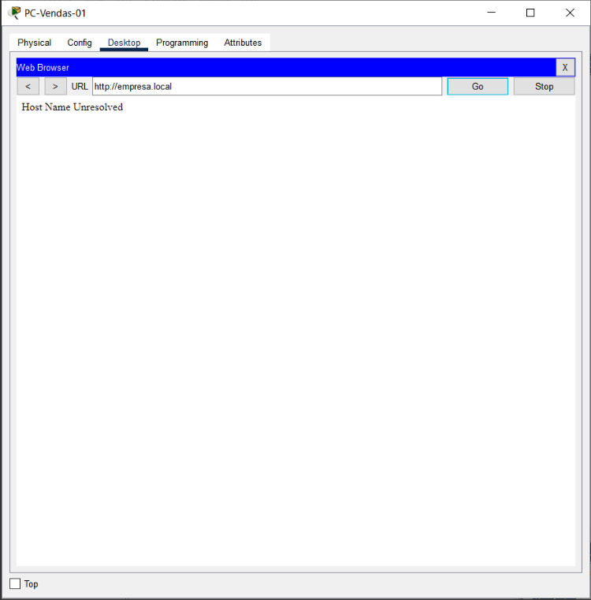
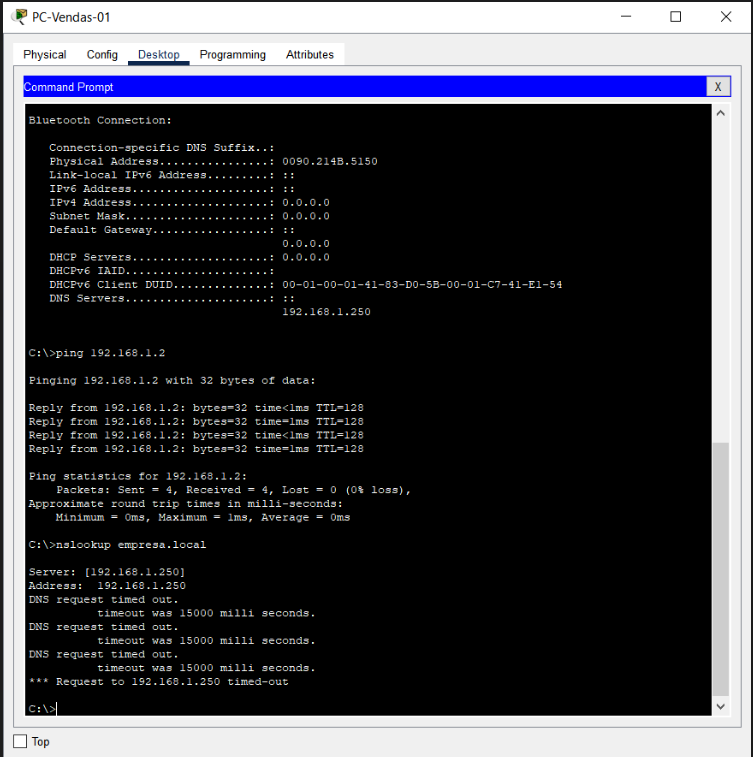
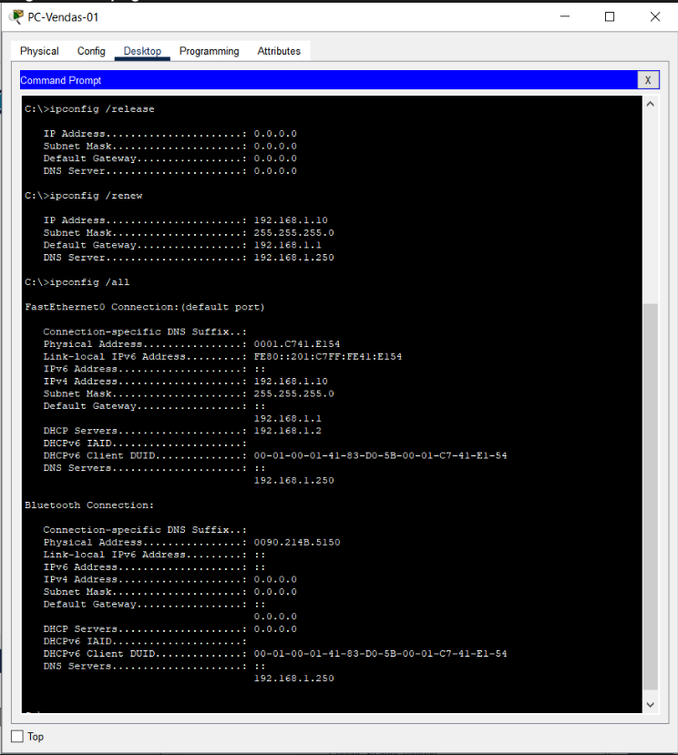
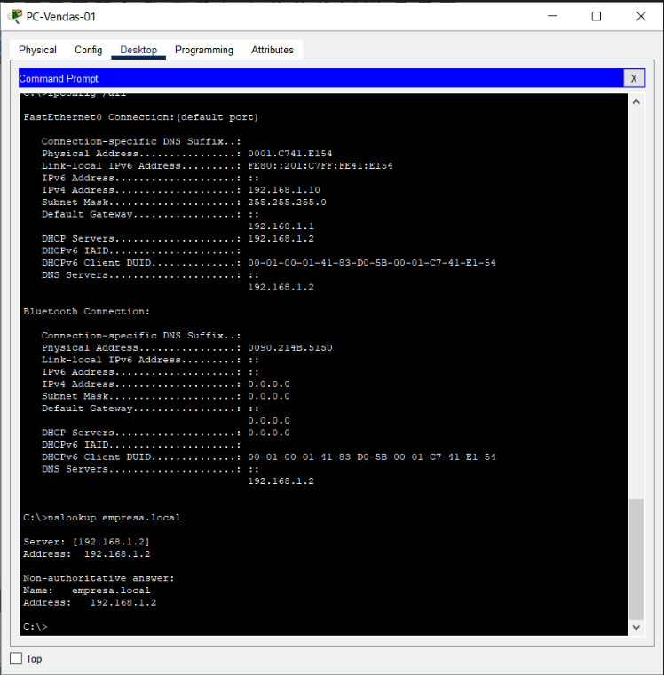
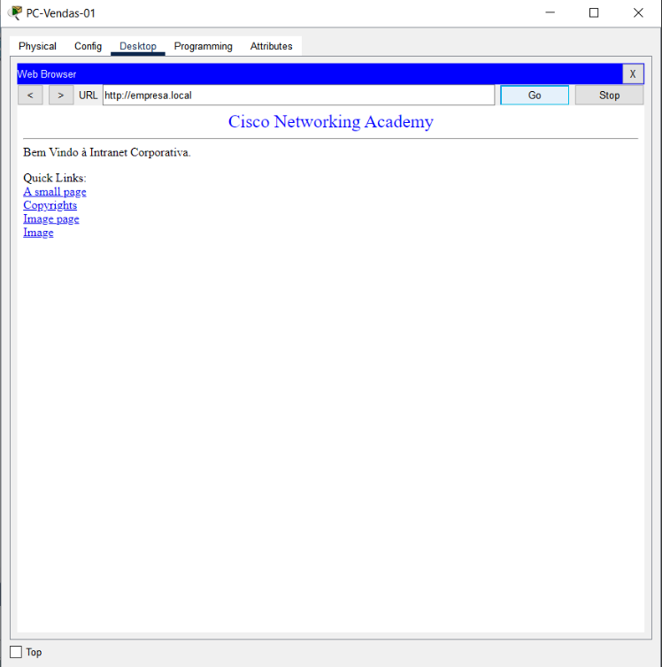

# Projeto 1: Infraestrutura de Rede Corporativa e Troubleshooting de Serviços (Cisco Packet Tracer)

## 📌 Visão Geral do Projeto
Este projeto consiste na implementação, validação e solução de problemas (troubleshooting) de uma infraestrutura de rede local corporativa utilizando o Cisco Packet Tracer. 

O ambiente conta com distribuição automática de endereçamento IP (DHCP), resolução de nomes interna (DNS) e hospedagem de aplicação web corporativa (HTTP).

---

## 📐 Estrutura da Topologia
- Roteador Central: 192.168.1.1/24 (Default Gateway)
- Servidor Corporativo Unificado: 192.168.1.2/24 (Serviços DHCP, DNS e Web)
- Escopo DHCP (Clientes): 192.168.1.10 a 192.168.1.50
- Arquivo de Topologia: O arquivo de simulação `infraestrutura_rede_corporativa.pkt` está disponível na raiz deste repositório para download e validação prática.

---

## 🧪 Serviços Configurados
1. DHCP Server: Distribuição automática de IP, Máscara, Gateway e Servidor DNS para os computadores clientes.
2. DNS Server: Mapeamento do nome de domínio FQDN `empresa.local` para o IP `192.168.1.2`.
3. HTTP Server: Hospedagem da página da Intranet Corporativa.

---

## 🔍 Estudo de Caso: Troubleshooting de Falha de DNS em Ambiente Corporativo

### 1. Cenário e Descrição do Incidente
Um usuário da estação de trabalho `PC-Vendas-01` abriu um chamado informando que não conseguia acessar o portal da Intranet Corporativa através do endereço web corporativo (`[http://empresa.local](http://empresa.local)`).

---

### 2. Análise e Diagnóstico Técnico (Passo a Passo)

#### Passo A: Reprodução do Sintoma
Acessou-se o navegador da estação de trabalho e tentou-se a navegação até a URL `[http://empresa.local](http://empresa.local)`. O navegador retornou o erro **"Host Name Unresolved"**, indicando falha na resolução do nome de domínio.

#### Passo B: Isolamento de Camada (Camada 3 vs. Resolução de Nomes)
Para descartar problemas físicos de cabeamento, porta de switch ou endereçamento IP (Camada 3), executou-se um teste ICMP (`ping 192.168.1.2`) diretamente para o IP do servidor web corporativo.

- Resultado: 0% de perda de pacotes e latência menor que 1ms. A conectividade IP direta entre a estação e o servidor está operacional.

Em seguida, testou-se a resolução de nomes via CLI (`nslookup empresa.local`).

- Resultado: Mensagem de erro "DNS request timed out" ao tentar consultar o servidor `192.168.1.250`.

#### Passo C: Identificação da Causa Raiz
Para inspecionar as configurações de rede fornecidas dinamente pelo servidor DHCP, executou-se o comando `ipconfig /all`.

- Análise: Verificou-se que a interface de rede recebeu o parâmetro `DNS Servers: 192.168.1.250`. Como o endereço do servidor DNS corporativo correto é `192.168.1.2`, constatou-se que o pool DHCP no servidor central estava distribuindo um IP de DNS inexistente para as estações clientes.

---

### 3. Ação Corretiva e Validação

1. Correção no Servidor: Ajustou-se a configuração do serviço DHCP no servidor central (`192.168.1.2`), corrigindo o parâmetro de DNS Server de `192.168.1.250` para `192.168.1.2`.
2. Renovação de Lease no Cliente: Na estação `PC-Vendas-01`, executou-se a renovação das configurações de rede com o comando `ipconfig /renew`.
3. Validação via CLI: O comando `ipconfig /all` confirmou a recepção do servidor DNS correto (`192.168.1.2`). A execução do `nslookup empresa.local` retornou com sucesso a tradução do FQDN para o IP `192.168.1.2`.

4. Validação na Aplicação (Web): O acesso via navegador foi restabelecido e validado em duas etapas:

- Acesso por nome de domínio (FQDN - `http://empresa.local`):

- Acesso direto por IP (`http://192.168.1.2`):

